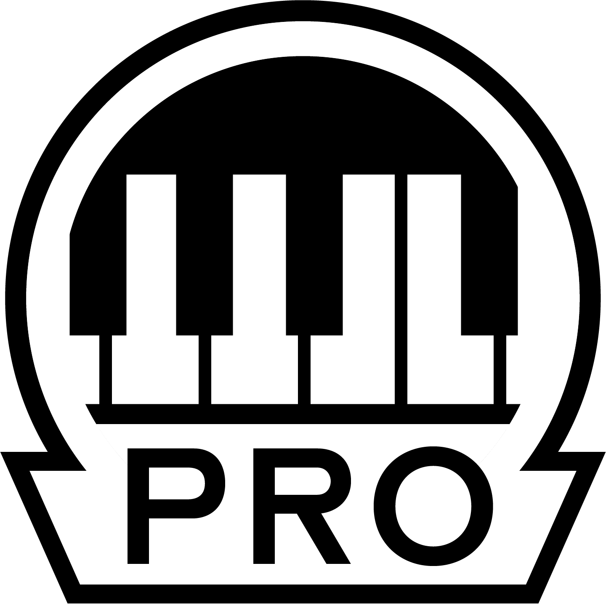

# Pro Keys
 Pro key upgrades allow for all applicable songs to be played on a real keyboard, either on the official RB3 keyboard or any MIDI keyboard via the Midi Pro Adapter. In addition to key charts, this repo also provides new audio tracks (moggs) containing isolated key stems for you to play along with. However, due to the fact acquiring the official stems is near-impossible, audio isolation algorithms such as demucs are used to separate the keys into their own stem. As a result, the key stems may not be 100% perfect (i.e., there may be some bleed from other instruments), but they are sufficient for the purposes of a proper key upgrade. To view who authored a particular key chart as well as who contributed the new mogg file with an isolated key stem, please look through that particular song's dta file.

# Installation

## Rock Band 3 Deluxe
To play these upgrades on RB3DX, visit the website, click "Downloads," and select the link for your specific console. However, you will need to replace some files to make the keys audio work.

### Xbox 360
- TBA

### PS3 (CFW/HEN)
To make keys moggs work on PS3, you will need to manually replace the one installed on your system as well as the song's dta file.
- Open Nautilus, and launch the PS3 Converter. Under "Encryption Options," select "Encrypt replacement mogg file."
- Select the mogg you got from this repo.
- Use an FTP client to transfer the new mogg and dta. (We recommend installing webMAN MOD or multiMAN for this.) Navigate to the game directory: ```dev_hdd0\game\BLUS30147\USRDIR``` for RBN songs; ```dev_hdd0\game\BLUS30050\USRDIR``` for everything else. Find the folder that contains the original song.
- Back up the original songs.dta to a safe location.
- If the songs.dta has only one song, simply overwrite it with the dta you got from this repo. However, if it's a pack of songs, you will need to open the new dta with the text editor of your choice, copy all of its contents, and paste them into the array that contains the upgraded song in the songs.dta on your system, replacing the original.
- Enter the song folder with the shortname of your mogg. Back up the original like you did with the songs.dta.
- Now, copy the newly encrypted mogg to the folder, overwriting the original.
- Your song is now ready to play. Boot up RB3 Deluxe and enjoy!

### Advanced
If the game crashes when trying to preview the audio, it has too many channels for the quality it was encoded with. You'll need Audacity to extract the stems and the Mogg Maker in Nautilus to make a new mogg. Follow the steps below.
- Start over by redownloading the mogg you got here, or use the Batch Cryptor in Nautilus to decrypt it. Open it in Audacity.
- Identify the stereo stems using the songs.dta as a guide and combine them into stereo tracks using the menu on the top track of each pair. Leave mono stems alone.
- Export each track as a WAV file (one at a time) via File > Export Audio.
   -Name each one according to it contents (kick, snare, kit, bass, guitar, etc.)
  - Leave the Audio Options alone except for Channels. This will need to be set according to the stem. In most cases, bass and kick drum stems are mono, and everything else is stereo. It defaults to Stereo, so be careful!
  - Export range should be set to Current Selection with "Trim blank space before first clip" unchecked.
- Launch the Mogg Maker in Nautilus. Drag and drop the newly exported stems in the order they appear in the mogg you got from here.
- Under Settings, set Encoding quality to 3, and check "Encrypt Mogg." Then click "Make Mogg."
- When it's finished, save it over the downloaded mogg or as a new file with the same name somewhere else.
- Transfer the fixed mogg to your console as described in the above section.
- Boot up RB3 Deluxe and enjoy!

### RPCS3
- TBA

Alternatively, if you do not have the means to install RB3DX onto your system, you can use the methods below in order to play these key upgrades - however, please note that due to how the vanilla version of RB3 handles legacy songs, the venue will be broken, and you will have one static camera angle throughout the song if you play on keys. If that does not bother you, please continue reading to see how to install these upgrades for your preferred system.

## Xbox 360 (JTAG/RGH)
In order to install a key upgrade on Xbox, you will need the song's original CON file and Nautilus to edit the file's contents. Also, once the process is complete, this song will only be compatible with Rock Band 3 - attempting to play it in any older Rock Band will cause your game to crash.
- Open Nautilus, and launch the Upgrade Bundler. Place the song's original CON file in the left window, and the *_plus.mid upgrade file in the right window. Click "Bundle!", and if the tool asks you for a song ID, it is fine to ignore and click OK, since you will be overwriting the songs.dta in the next step anyway.
- There should be a new CON created. It should share the same name with the original CON, except with "(bundled)" at the end. Drag this CON into the Nautilus window.
- Click the "Contents" tab in order to view the files inside the CON. 
  - First, click the songs folder to view the original songs.dta. Right click it, select "Replace selected files", and replace it with the songs.dta you got from this repo.
  - Next, click the shortname's folder to view the midi file and the mogg file. Right click the mogg file, select "Replace selected files", and replace it with the .mogg you got from this repo.
  - Finally, click the "Information" tab and click "Save" in order to rebuild the CON with these new files.
- Your CON is now ready to play. Place it in your system where you grabbed the original CON, and then boot up RB3 and enjoy!

## RPCS3
- TBA
